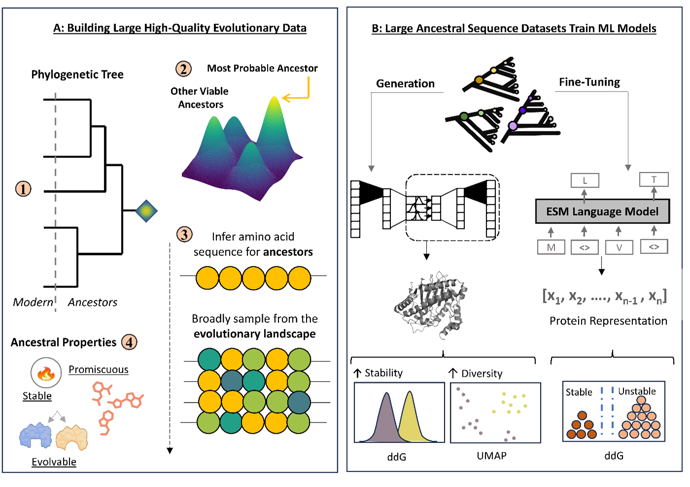

# EvoSeq-ML: Enhancing Protein Engineering with Evolutionary Data

Welcome to the EvoSeq-ML project! 🎉 This project leverages ancestral sequence reconstruction (ASR) to enhance machine learning models for protein engineering. Our approach aims to improve protein sequence generation and fine-tuning using rich evolutionary data.

## Table of Contents
- [Introduction](#introduction)
- [Preprocessing and Ancestral Sequence Reconstruction](#preprocessing-and-ancestral-sequence-reconstruction)
- [Protein Sequence Generation](#protein-sequence-generation)
- [Protein Sequence Fine-Tuning](#protein-sequence-fine-tuning)
- [How to Use](#how-to-use)
- [Contributing](#contributing)
- [License](#license)

## Introduction

In protein engineering, advancements in machine learning (ML) have led to significant progress, such as predicting protein structures and generating novel proteins. However, the importance of high-quality data curation is often overlooked. EvoSeq-ML integrates ASR into ML models, providing diverse and stable sequences with rich evolutionary information. This approach enhances ML model performance in tasks related to protein sequence generation and fitness prediction.

## Preprocessing and Ancestral Sequence Reconstruction

1. **Building Evolutionary Data:**
    - We start by constructing phylogenetic trees to infer ancient protein sequences from modern descendants.
    - ASR offers deeper insights into protein evolution, capturing mutation rates, phylogenic relationships, and evolutionary trajectories.

2. **Ancestral Sequence Inference:**
    - Using both Bayesian inference and maximum likelihood methods, we generate ensembles of ancestral sequences.
    - These sequences provide a robust dataset that reflects the complexity and diversity of biological systems.

3. **Key Benefits:**
    - Ancestral sequences are often more stable, promiscuous, and evolvable, making them ideal for training ML models.

## Protein Sequence Generation

- **Generative Models:**
    - We use Variational Autoencoders (VAEs) to generate novel protein sequences.
    - The training data includes ancestral sequences reconstructed through ASR, ensuring high-quality and diverse inputs.

- **Evaluation:**
    - Generated sequences are evaluated for structural stability, sequence variability, and semantic diversity using tools like AlphaFold and FoldX.

## Protein Sequence Fine-Tuning

- **Language Model Fine-Tuning:**
    - We fine-tune the ESM protein language model with ancestral data to create evolutionary-driven protein representations.
    - These fine-tuned models are used for downstream tasks like stability prediction.

- **Performance:**
    - Our evolutionary-driven representations have shown improved performance in protein classification tasks, demonstrating the effectiveness of integrating ASR data.

